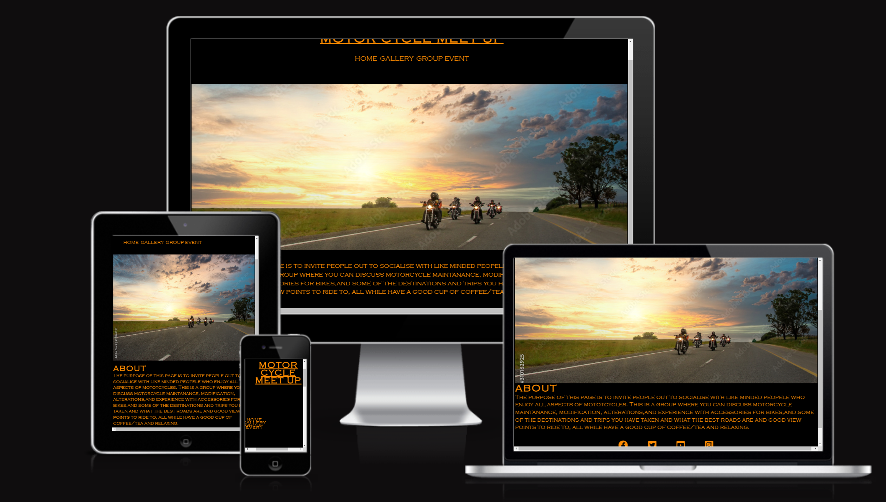
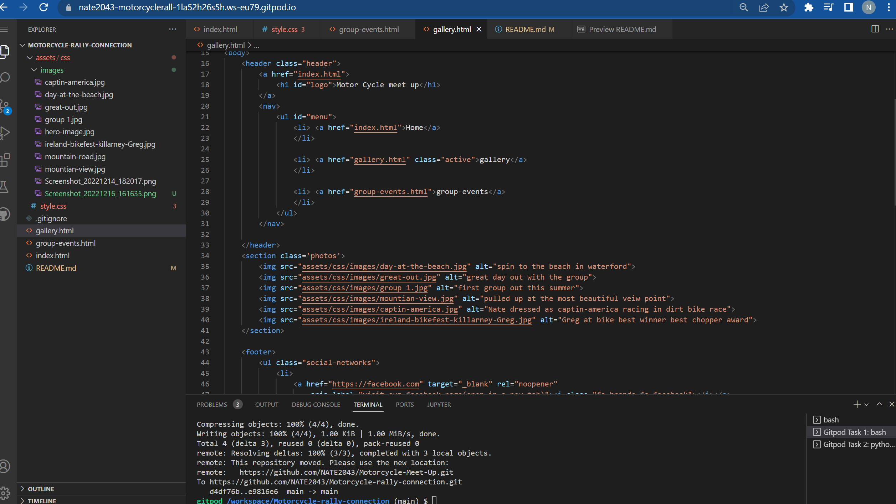
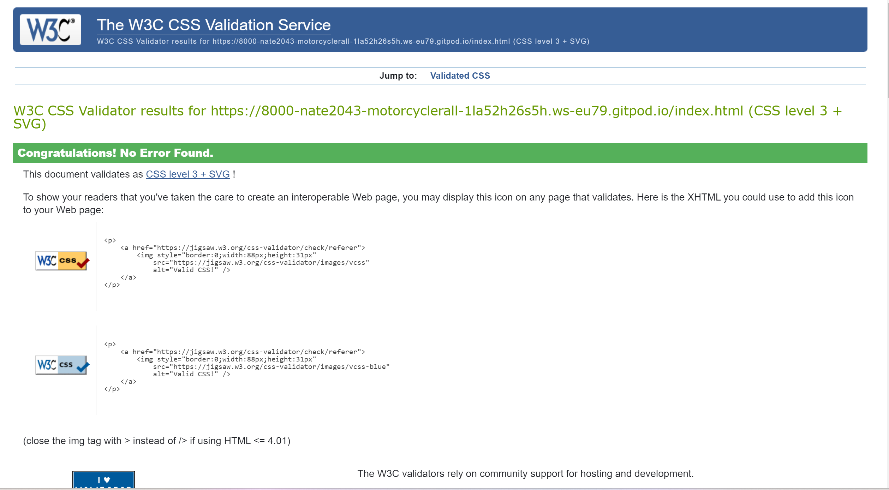
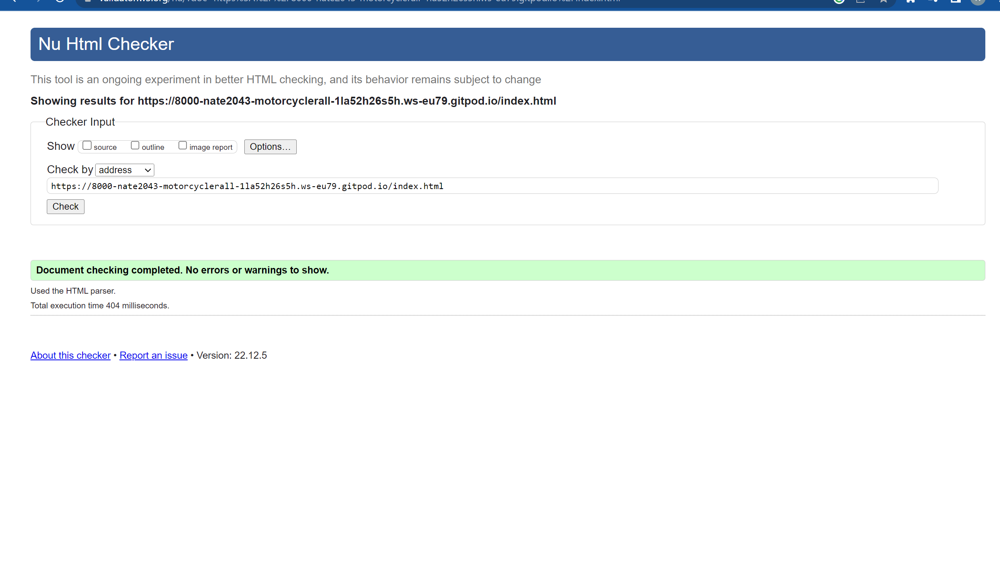
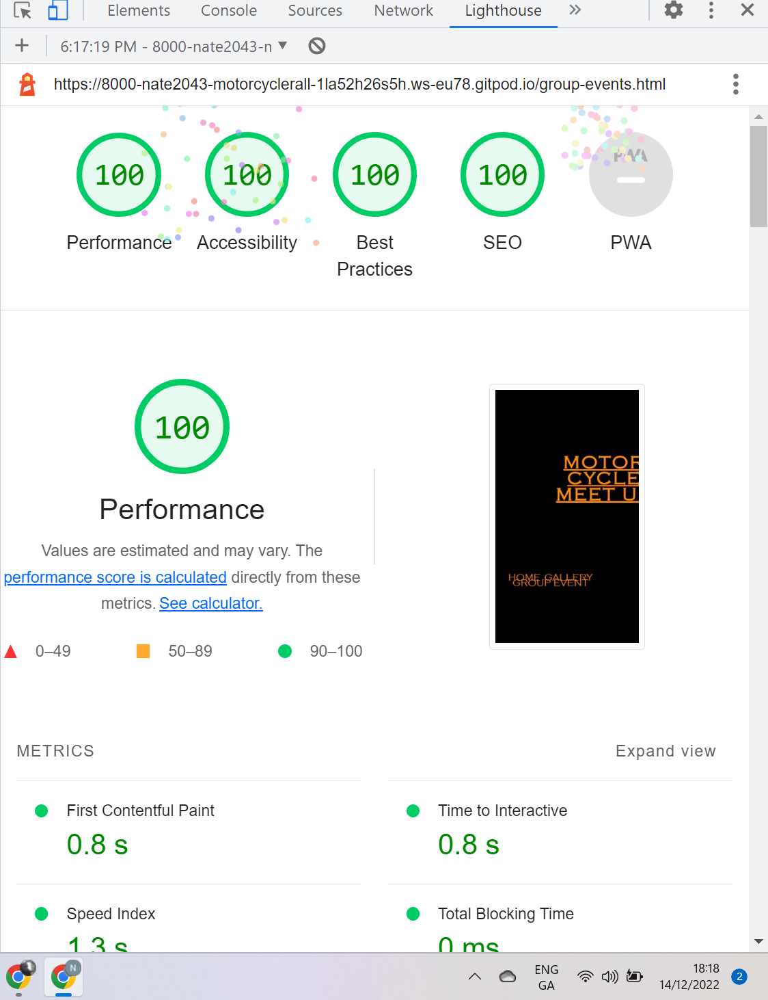
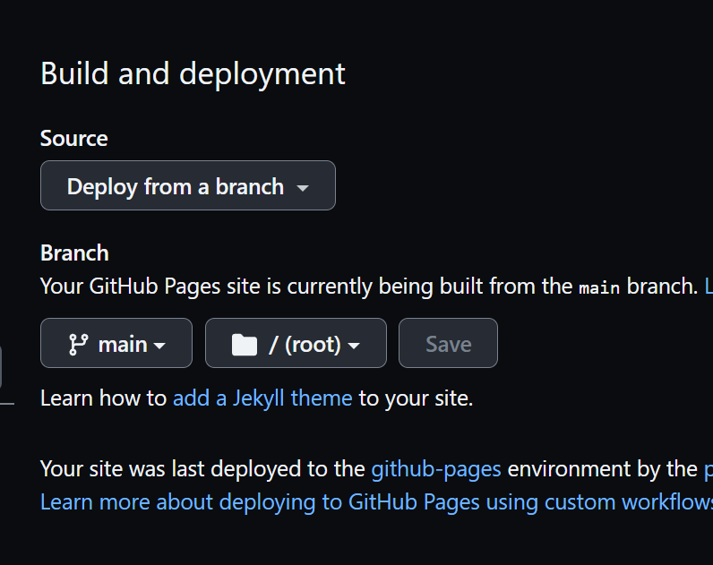

Welcome all to my fist page,

# Motor Cycle Meet Up
This meet up website is for motorcycle enthusiasts!
It's designed to be a friendly place to plan day trips, over nighters to rallys accross the country, tours short and long country wide and accross europe during the summer months.
In general all the things motorcycle related and just good fun.
Its a place to make memmories.#
using this website as apossed to other platforms cam be refreshing without all the other clutter from social media, through the website theres been many friendships made through the commune.
if theres any problems with the code please contact me and just point them out and ill do my very best to fix them right away.




## Features
Featured at the top of the page id the logo ( MOTOR CYCLE MEET UP ) and a the nav bar which in the nav bar you can navigate between the 
HOME,
GALLERY,
GROUP EVENTS,
sections which is currently empty due to it being december and all events are canceled due to safety reasons.
The color choosen for this the page and the font was dark orange i think its suits the page and its aspects and its easy to read and is visually pleasing, the fonts are copperplate gothic light as i felt it suits the feel of the page and the type of people who will view this page its nice and sharpe and stands out.
The navigation is clearly labled for users to easily find there way through the page and the social media links are clickable.

## Heading
The Heading clearly states the meaning and purpose of the page its in the same font and Colour as the rest of the page as I feel its suits it.

## About 
The about section explains what the webpage is for and why its been created and what the main goal of the page is.

## Gallery
the Gallery section show some of the trips taken by people who joined on the days advertised and one one of the lads at a charity even dressed as captin america.

## Group Events
The Group events sections os where events are posted and anyone who wants to join may come on the day and for anyone who wants to joing the cross country / europe tours details of date time and travel routes will be posted here along with details of transport such as ferry's.


## Gallery


## Social Media links
I've made the social media link interactive so tha the page can be more interactive and user freindly, One must just hover over and see the white line highlighting the social link required and simply click and it will take you to the platform of your choice.

## Testing
ive checked that the page page looks good and usable on all screen sizes except iphone sizes its i cant figure that one out but i will rectify it asap.
I used [am i responsive](https://ui.dev/amiresponsive) to checand see if it work and it dose.
I can confim that the webpage opens in chrome.

## Validator
I checked the css and its passed, 
I checked the HTML and its passed 
light socres 100% 

## Deployment
This page was deployed to github the steps are as follows.
1. Go to github.com/respositories
2. Select settings
3. on the left hand side of the menu you will see "Pages" select that option.
4. once in github pages section, select the branch section that says none chnage this to main and click save and it will deploy  a

## Content
the code for the social media link was taken from the love running project from code institue.

## Media
The media in the webpage was taken from google images. and from bikefest in kilareny a friend who won an award for his bike.

## Gitpod Reminders

To run a frontend (HTML, CSS, Javascript only) application in Gitpod, in the terminal, type:

`python3 -m http.server`

A blue button should appear to click: _Make Public_,

Another blue button should appear to click: _Open Browser_.

To run a backend Python file, type `python3 app.py`, if your Python file is named `app.py` of course.

A blue button should appear to click: _Make Public_,

Another blue button should appear to click: _Open Browser_.

In Gitpod you have superuser security privileges by default. Therefore you do not need to use the `sudo` (superuser do) command in the bash terminal in any of the lessons.

To log into the Heroku toolbelt CLI:

1. Log in to your Heroku account and go to *Account Settings* in the menu under your avatar.
2. Scroll down to the *API Key* and click *Reveal*
3. Copy the key
4. In Gitpod, from the terminal, run `heroku_config`
5. Paste in your API key when asked

You can now use the `heroku` CLI program - try running `heroku apps` to confirm it works. This API key is unique and private to you so do not share it. If you accidentally make it public then you can create a new one with _Regenerate API Key_.

------

## Release History

We continually tweak and adjust this template to help give you the best experience. Here is the version history:

**September 1 2021:** Remove `PGHOSTADDR` environment variable.

**July 19 2021:** Remove `font_fix` script now that the terminal font issue is fixed.

**July 2 2021:** Remove extensions that are not available in Open VSX.

**June 30 2021:** Combined the P4 and P5 templates into one file, added the uptime script. See the FAQ at the end of this file.

**June 10 2021:** Added: `font_fix` script and alias to fix the Terminal font issue

**May 10 2021:** Added `heroku_config` script to allow Heroku API key to be stored as an environment variable.

**April 7 2021:** Upgraded the template for VS Code instead of Theia.

**October 21 2020:** Versions of the HTMLHint, Prettier, Bootstrap4 CDN and Auto Close extensions updated. The Python extension needs to stay the same version for now.

**October 08 2020:** Additional large Gitpod files (`core.mongo*` and `core.python*`) are now hidden in the Explorer, and have been added to the `.gitignore` by default.

**September 22 2020:** Gitpod occasionally creates large `core.Microsoft` files. These are now hidden in the Explorer. A `.gitignore` file has been created to make sure these files will not be committed, along with other common files.

**April 16 2020:** The template now automatically installs MySQL instead of relying on the Gitpod MySQL image. The message about a Python linter not being installed has been dealt with, and the set-up files are now hidden in the Gitpod file explorer.

**April 13 2020:** Added the _Prettier_ code beautifier extension instead of the code formatter built-in to Gitpod.

**February 2020:** The initialisation files now _do not_ auto-delete. They will remain in your project. You can safely ignore them. They just make sure that your workspace is configured correctly each time you open it. It will also prevent the Gitpod configuration popup from appearing.

**December 2019:** Added Eventyret's Bootstrap 4 extension. Type `!bscdn` in a HTML file to add the Bootstrap boilerplate. Check out the <a href="https://github.com/Eventyret/vscode-bcdn" target="_blank">README.md file at the official repo</a> for more options.

------

## FAQ about the uptime script

**Why have you added this script?**

It will help us to calculate how many running workspaces there are at any one time, which greatly helps us with cost and capacity planning. It will help us decide on the future direction of our cloud-based IDE strategy.

**How will this affect me?**

For everyday usage of Gitpod, it doesn’t have any effect at all. The script only captures the following data:

- An ID that is randomly generated each time the workspace is started.
- The current date and time
- The workspace status of “started” or “running”, which is sent every 5 minutes.

It is not possible for us or anyone else to trace the random ID back to an individual, and no personal data is being captured. It will not slow down the workspace or affect your work.

**So….?**

We want to tell you this so that we are being completely transparent about the data we collect and what we do with it.

**Can I opt out?**

Yes, you can. Since no personally identifiable information is being captured, we'd appreciate it if you let the script run; however if you are unhappy with the idea, simply run the following commands from the terminal window after creating the workspace, and this will remove the uptime script:

```
pkill uptime.sh
rm .vscode/uptime.sh
```

**Anything more?**

Yes! We'd strongly encourage you to look at the source code of the `uptime.sh` file so that you know what it's doing. As future software developers, it will be great practice to see how these shell scripts work.

---

Happy coding!
